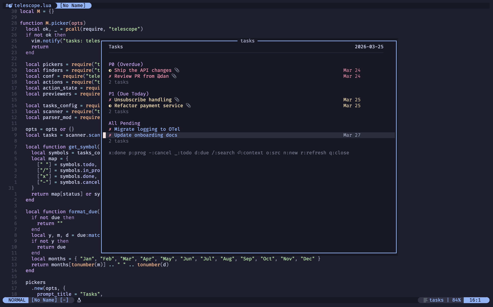
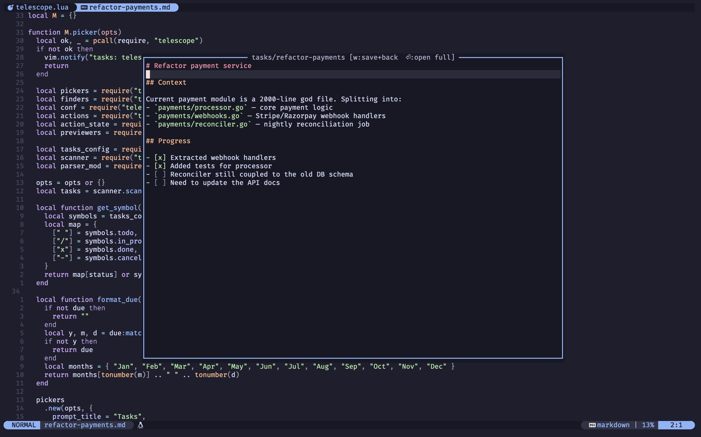
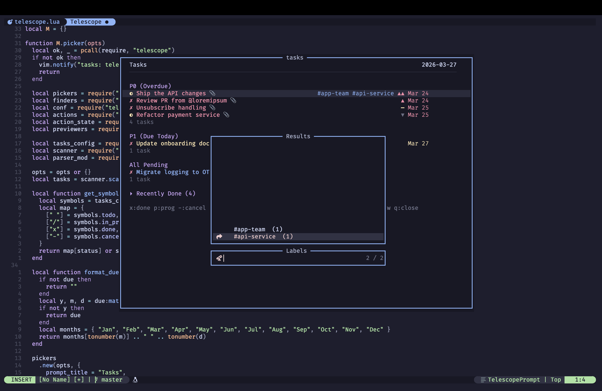
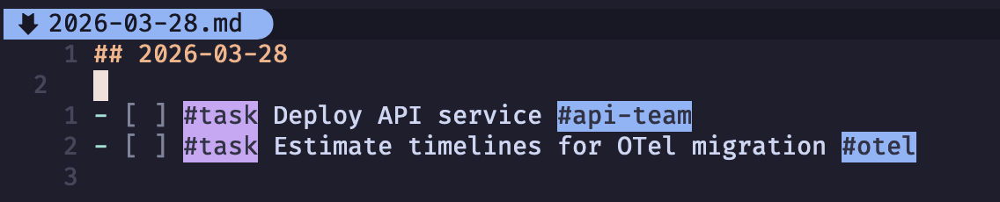

# tasks.nvim

Markdown-native task management for Neovim.

Works alongside Obsidian, vimwiki like note-taking system. Complete feature
list [here](#features).

> [!NOTE]
> There are already loads of task management tools available. This note-taking
> setup is mostly tailored for ease of my personal workflow and to solve
> problems that I face.
>
> Creating this repository in case people find any utility in this way of
> note-taking.

## How it works

Tasks are markdown checkboxes with a `#task` tag and optional metadata:

```markdown
- [ ] #task Ship the API changes  [due:: 2026-03-25]  [priority:: high]
- [/] #task Review PR from @loremipsum  [due:: 2026-03-24]
- [x] #task Fix auth middleware  [due:: 2026-03-20]  [completion:: 2026-03-21]
- [-] #task Migrate to Redis (cancelled)
```

Statuses: `[ ]` todo · `[/]` in-progress · `[x]` done · `[-]` cancelled

Tasks can link to note files for context:

```markdown
- [/] #task Refactor payment service [[tasks/refactor-payments]]  [due:: 2026-03-25]  [priority:: high]
```

The linked file (`tasks/refactor-payments.md`) holds whatever context you need:
description, links, subtasks, scratch notes. Press `<CR>` on the task to
view/edit it inline in the dashboard float.

## The Dashboard

`:Tasks` opens a floating window with your tasks grouped by urgency:



`📎` means the task has a linked note. `j`/`k` skip between tasks.

Press `<CR>` on a task to open its note inline, editable in the same float.
`:w` saves and returns to the task list. `<CR>` again opens it in a full
buffer.

## Dashboard Keymaps

| Key | Action |
|---|---|
| `x` | Mark done |
| `p` | Mark in-progress |
| `-` | Mark cancelled |
| `<Space>` | Mark todo |
| `e` | Edit task (description, due date, priority) |
| `<CR>` | Open note context inline (creates note + wiki-link if none exists) |
| `o` | Jump to source file at the task line |
| `n` | Create new task |
| `/` | Fuzzy search (fzf-style bar, filters live as you type) |
| `l` | Filter by label (telescope picker) |
| `L` | Clear label filter |
| `u` | Undo last status change |
| `<C-r>` | Redo |
| `<Tab>` | Expand/collapse section |
| `r` | Refresh |
| `q` / `:q` | Close |

### Note view (after `<CR>`)

The note opens in the same floating window, fully editable.



| Key | Action |
|---|---|
| `:w` | Save and return to task list |
| `:wq` / `:q` | Same — save and return |
| `<CR>` | Open note in a full buffer |
| `<leader>w` | Save and return to task list |

### Search

Press `/` in the dashboard. A search bar appears above the float. Type to
fuzzy-filter across task descriptions, dates, priorities, and tags. `<CR>` or
`<Esc>` accepts the filter and drops you back into the filtered list. `<C-c>`
clears the filter. `<Esc>` in the dashboard clears an active filter.

## Labels

Tag tasks with `#projectname` to group them by project:

```markdown
- [ ] #task #api-team Deploy API service  [due:: 2026-03-28]
- [ ] #task #otel Estimate timelines for OTel migration
```

Press `l` in the dashboard to open the label picker (telescope-powered,
searchable). Select a label to filter and the dashboard switches to a
status-grouped view showing all tasks for that project: In Progress, Todo, and
Done.



Press `L` to clear the filter and return to the default urgency view.

## Inline rendering

`#task` and `#label` tags are highlighted in the buffers in normal mode.



Highlights clear in insert mode so you see the raw markdown while editing.

## Inline toggle

`<C-Space>` on any `#task` line in a markdown/vimwiki buffer cycles the status:

`[ ]` → `[/]` → `[x]` → `[-]` → `[ ]`

Falls back to `VimwikiToggleListItem` on non-task lines.

## Query blocks

> [!NOTE]
> I am not too sure about this feature if I'll find a need for it or support it
> going forward.

If your markdown files have query blocks like this:

````markdown
```tasks
not done
due before today
sort by due
```
````

`:TaskQuery` evaluates the nearest block and shows results in the dashboard.

Supported clauses: `not done`, `done`, `due today`, `due before today`, `due
after today`, `no due date`, `has due date`, `priority is <level>`, `sort by
due`, `sort by priority`, `(A) OR (B)`.

## Requirements

- Neovim 0.9+
- [ripgrep](https://github.com/BurntSushi/ripgrep) (for vault scanning)

Optional:
- [telescope.nvim](https://github.com/nvim-telescope/telescope.nvim) for `:TaskFind`

## Install

With packer:

```lua
use {
    'vipul-sharma20/tasks.nvim',
    config = function()
        require("tasks").setup()
    end
}
```

With lazy.nvim:

```lua
{
    'vipul-sharma20/tasks.nvim',
    config = function()
        require("tasks").setup()
    end
}
```

## Setup

```lua
require("tasks").setup({
    vault_path = "~/notes",       -- root of your markdown vault
    diary_path = "~/notes/diary", -- where diary entries live
    tasks_path = "tasks",         -- note files dir (relative to vault_path)

    sections = {
        { name = "P0 (Overdue)",  query = "not done\ndue before today\nsort by due" },
        { name = "P1 (Due Today)", query = "not done\ndue today\nsort by due" },
        { name = "All Pending",   query = "not done\n(due after today) OR (no due date)" },
    },

    symbols = {
        todo        = "✗",
        in_progress = "◐",
        done        = "✓",
        cancelled   = "●",
    },

    width  = 0.6, -- float width as fraction of editor
    height = 0.7,
})
```

All fields are optional. Defaults are shown above.

## Commands

| Command | Description |
|---|---|
| `:Tasks` | Open the dashboard |
| `:TaskCreate` | Create a new task (prompts for description, due date, priority, note) |
| `:TaskToggle` | Toggle status of task under cursor |
| `:TaskQuery` | Evaluate the nearest ```` ```tasks ```` block |
| `:TaskFind` | Telescope picker across all tasks |

## Suggested keymaps

```lua
-- with which-key
t = {
    name = "Tasks",
    d = { "<cmd>Tasks<cr>", "Dashboard" },
    f = { "<cmd>TaskFind<cr>", "Find" },
    n = { "<cmd>TaskCreate<cr>", "New" },
    t = { "<cmd>TaskToggle<cr>", "Toggle" },
    q = { "<cmd>TaskQuery<cr>", "Query Block" },
}
```

## Task format reference

```markdown
- [ ] #task Description [[optional/note-link]]  [due:: YYYY-MM-DD]  [priority:: high]  [completion:: YYYY-MM-DD]
```

| Field | Required | Values |
|---|---|---|
| Checkbox | Yes | `[ ]`, `[/]`, `[x]`, `[-]` |
| `#task` | Yes | Marker that identifies the line as a task |
| Description | Yes | Free text, can include markdown links and @mentions |
| `[[link]]` | No | Wiki-link to a note file with task context |
| `[due:: DATE]` | No | Due date in YYYY-MM-DD |
| `[priority:: LEVEL]` | No | `highest`, `high`, `medium`, `low`, `lowest` |
| `[completion:: DATE]` | No | Auto-added when marking done/cancelled |

Date input accepts: `2026-03-25`, `today`, `tomorrow`, `tmr`, `+3d`, `+7d`, `next week`.

## Features

- Floating dashboard (:Tasks) with configurable sections — P0 (overdue), P1 (due today), all pending, recently done
- Inline task status toggle — <C-Space> cycles [ ] → [/] → [x] → [-] on #task lines
- Task context via wiki-links — [[tasks/slug]] links to note files, viewable and editable inline in the dashboard float
- fzf-style search bar — / in dashboard for live fuzzy filtering across descriptions, dates, tags
- Full task editing — e to edit description, due date, and priority in one flow; renames linked note files automatically
- Status management — x/p/-/<Space> to mark done/in-progress/cancelled/todo with undo (u) and redo (<C-r>)
- Priority indicators — ▲▲ ▲ ━ ▼ ▼▼ rendered inline in the dashboard with color coding
- Collapsible sections — <Tab> to expand/collapse (recently done section collapsed by default)
- Natural date input — accepts today, tomorrow, +3d, next week when setting due dates
- Telescope picker — :TaskFind for fuzzy search across all tasks in the vault
- Query block evaluation — :TaskQuery evaluates ```tasks blocks from your markdown files
- Labels — tag tasks with #project, filter dashboard by label via telescope picker, status-grouped view
- Inline highlighting — #task and #label tags rendered as colored pills in markdown buffers, motions unaffected
- :w / :wq / :q work naturally in the floating window note view

## License

MIT
